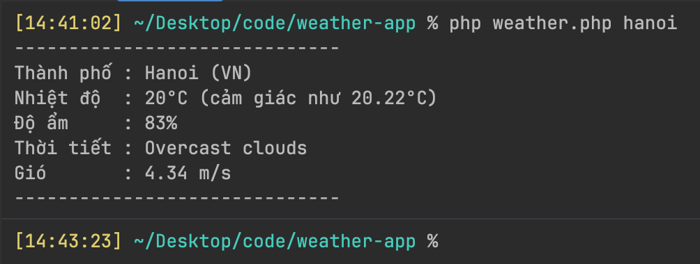

# Weather app (php)

Ứng dụng cli đơn giản giúp xem thông tin thời tiết bằng cách nhập tên thành phố.  
Dữ liệu được lấy từ openweathermap api.

## Features

- Xem thông tin thời tiết theo tên thành phố ngay trên CLI
- Báo lỗi nếu nhập sai, bỏ trống hoặc api không phản hồi

## Technology

- PHP
- Guzzlehttp (http client để call api)
- Vlucas/phpdotenv (quản lý file .env)
- OpenWeatherMap API